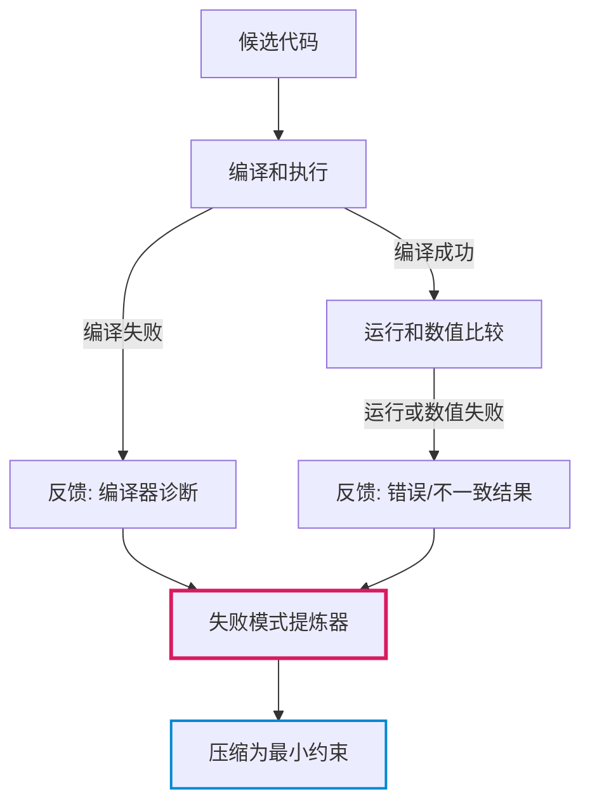
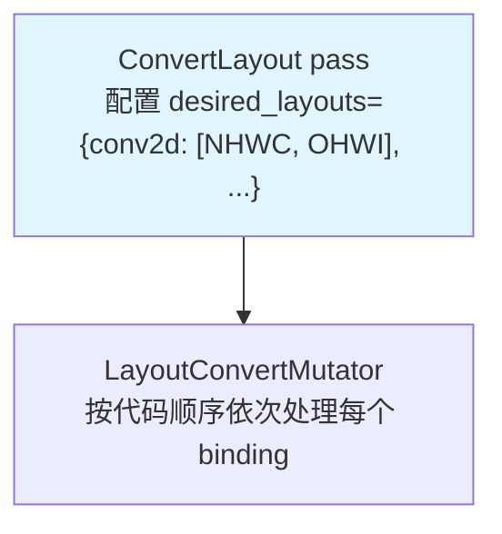
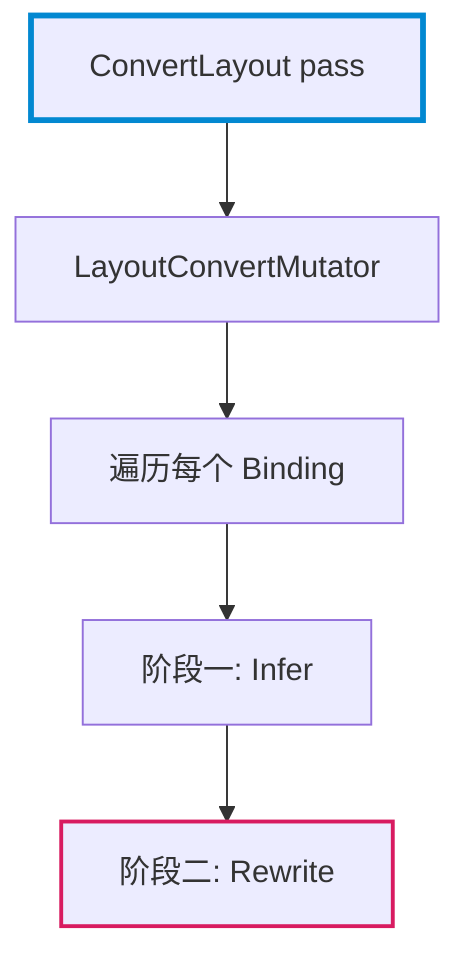

# Markdown Report Writer

Professional assistant for writing reports using Markdown. **Prefer the shortest explanation that preserves correctness, context, and readability.**

## Core Writing Principles

### 1. Clarity Before Detail

Write for clarity first, then add detail only when it helps the reader understand the argument. Do not explain every term or code line by default. Expand when:

- The concept is necessary for understanding later reasoning.
- The user is likely unfamiliar with the term.
- The code behavior is non-obvious.
- The conclusion depends on a subtle distinction.

Avoid repeating the same idea in the introduction, explanation, and summary. A section may use one short lead sentence before technical content; it does not need a full paragraph unless the context is genuinely complex.

### 2. Define Important Concepts Before Use

Core concepts must be defined before they are used in analysis, diagrams, or code interpretation. A core concept is a term that the reader must understand to follow the subsequent argument — such as an IR node, compiler pass, data structure, scheduling primitive, hardware component, or mathematical object.

Ordinary technical terms do not always need standalone definitions. Acronym expansion and short clarifications may use parentheses when they do not interrupt the sentence:

```markdown
TIR（Tensor IR）是 TVM 的低层张量中间表示。
```

Avoid parenthetical dumps that define several important concepts at once:

```markdown
<!-- BAD: too many concepts crammed into parentheses -->
PrimFunc 是 TIR（Tensor IR，TVM 的低层中间表示）层的核心 IR 单元，包含 buffer（TIR 中表示一块有形状和数据类型的线性内存区域，通过多维索引访问）访问代码。这些 PrimFunc 尚未被分配 tiling（将循环拆分为多层 tile）策略。

<!-- GOOD: core concepts get their own sentences, acronyms use light parentheses -->
PrimFunc 是 TVM 低层中间表示 TIR（Tensor IR）的核心 IR 单元。它包含完整的循环嵌套，循环体内是对 buffer 的读写。buffer 是 TIR 层的数据容器：一个有形状和数据类型的内存块，通过多维索引访问其中元素。接下来的关键步骤是确定 tiling：将大循环按 tile 拆分成多层嵌套，以利用缓存局部性和并行能力。
```

### 3. Narrative Flow Without Over-Explaining

A section should not start abruptly with a formula, list, table, or code block unless the user explicitly asks for terse notes. Usually, one short lead sentence is enough to introduce the technical content.

After presenting code, data, or a diagram, add only the interpretation needed to connect it to the argument. Do not repeat the same point in the introduction, explanation, and conclusion.

**BAD** (abrupt start, content dump):
```markdown
## Results

- Metric A: 123
- Metric B: 456
- Metric C: 789
```

**GOOD** (one lead sentence, then content):
```markdown
## Results

The experiment yielded three key metrics under controlled conditions:

- Metric A: 123 — baseline performance
- Metric B: 456 — improvement over baseline
- Metric C: 789 — confirms the theoretical prediction
```

### 4. Explain Code Selectively

Source code blocks need context before and interpretation after. For short code blocks, one sentence before and one sentence after is sufficient. Use line-by-line explanation only when the code contains non-obvious control flow, hidden assumptions, important API behavior, or implementation details that support the main argument.

For real source excerpts, cite the file path and line range whenever available. For illustrative examples or pseudocode, label them clearly as examples and do not invent source locations.

**BAD** (bare code block, no interpretation):
```markdown
The ApplyDefaultSchedule pass processes each function:

```python
@module_pass(opt_level=0, name="ApplyDefaultSchedule")
class ApplyDefaultSchedule:
    def transform_module(self, mod, ctx):
        for g_var, func in mod.functions_items():
            if isinstance(func, tirx.PrimFunc) and not _is_scheduled(func):
                sch = _apply_rules(func, target, self.rules, tunable=False)
```
```

**GOOD** (context before, interpretation after — line-by-line only for non-obvious logic):
```markdown
The ApplyDefaultSchedule pass processes each function in the module. The implementation logic is directly visible in `transform_module`（源码：python/tvm/s_tir/dlight/base/transform.py）:

```python
@module_pass(opt_level=0, name="ApplyDefaultSchedule")
class ApplyDefaultSchedule:
    def transform_module(self, mod, ctx):
        for g_var, func in mod.functions_items():
            # 条件①：必须是 PrimFunc（TIR 函数），而非 Relax 函数
            # 条件②：_is_scheduled 检查已标记函数，跳过避免重复
            if isinstance(func, tirx.PrimFunc) and not _is_scheduled(func):
                # _apply_rules 逐条尝试规则，tunable=False 只返回确定结果
                sch = _apply_rules(func, target, self.rules, tunable=False)
```

The `isinstance` check filters out non-TIR functions. `_is_scheduled` reads `func.attrs["tirx.is_scheduled"]` — a boolean flag set by any scheduling pass that has already processed this function. `_apply_rules` tries each rule in priority order; `tunable=False` means each rule returns a single deterministic schedule.
```

### 5. Control Paragraph Information Density

A single paragraph should focus on one main idea or one level of detail. When a paragraph needs to explain multiple components, data flow stages, or causal relationships, readers struggle to process all information at once.

**Guideline**: If a paragraph contains more than 4-5 distinct information points (especially when they span different dimensions like data flow, control flow, selectivity, and semantic meaning), consider splitting into a list or multiple shorter paragraphs.

**IMPORTANT**: 控制信息密度的正确方法**不是简单随意切分段落**，而是用更合适的表达形式替代部分文字描述。优先使用：

1. **Mermaid 流程图**：替代算法流程、控制流、反馈循环的密集文字描述
2. **伪代码**：替代复杂逻辑、算法步骤、实现细节的文字说明
3. **数学公式**：替代数学关系、计算过程、约束条件的文字叙述

这些表达形式能让读者更快理解结构和逻辑，同时保持文字的简洁性。

**BAD** (information overload — 11 points in one dense paragraph):
```markdown
图 2 左侧的 Adapt 按箭头形成一个跨任务闭环。首先，`Seed Program` 与 `Documentation` 提供已有 PyTorch 示例和可用算子说明，二者经由 `Synthesize` 生成新的 `Training Program`；它是可执行的高层参考任务，而不是最终优化目标。随后，agent 根据该任务执行 `Generate Kernel`，尝试写出对应的 Triton 内核。`Testing` 将生成内核与参考任务一起运行，`Get Execution Feedback` 返回编译错误、运行错误或正确性结果。`Extract Failure Patterns` 只从失败候选及其反馈中提炼重复出现的限制；`Clustering` 将语义相近的限制合并，写入 `Update Skill Memory`。最后，更新后的记忆沿 `Injecting` 箭头加入下一轮 `Generate Kernel` 的提示词，使后续候选能够避开已知陷阱。图中的环形箭头表示该过程会在多个合成任务上持续重复，因而记忆是跨任务积累的。
```

**GOOD** (split into digestible pieces):

Option 1 — Lead sentence + structured list:
```markdown
图 2 左侧的 Adapt 形成一个跨任务学习闭环：从合成任务开始，收集失败模式，更新记忆，再注入下一轮生成。该闭环包含四个阶段：

- **任务合成**：`Seed Program` 与 `Documentation` 提供现有 PyTorch 示例和算子说明，经由 `Synthesize` 生成新的 `Training Program`。这些程序是高层参考任务，不是最终优化目标。
- **内核生成与测试**：agent 根据 `Training Program` 执行 `Generate Kernel`，尝试写出对应的 Triton 内核。`Testing` 将生成内核与参考任务一起运行，`Get Execution Feedback` 返回编译错误、运行错误或正确性结果。
- **失败模式提取**：`Extract Failure Patterns` 只从失败候选及其反馈中提炼重复出现的限制，忽略成功样本。`Clustering` 将语义相近的限制合并，写入 `Update Skill Memory`。
- **记忆注入与循环**：更新后的记忆沿 `Injecting` 箭头加入下一轮 `Generate Kernel` 的提示词，使后续候选能够避开已知陷阱。图中的环形箭头表示该过程在多个合成任务上持续重复。
```

Option 2 — Split by stages (when the diagram is already clear):
```markdown
图 2 左侧的 Adapt 形成一个跨任务闭环。

**任务合成阶段**：`Seed Program` 与 `Documentation` 提供已有 PyTorch 示例和可用算子说明，经由 `Synthesize` 生成新的 `Training Program`。它是可执行的高层参考任务，而不是最终优化目标。

**内核生成与验证阶段**：agent 根据 `Training Program` 执行 `Generate Kernel`，尝试写出对应的 Triton 内核。`Testing` 将生成内核与参考任务一起运行，`Get Execution Feedback` 返回编译错误、运行错误或正确性结果。

**失败模式提取阶段**：`Extract Failure Patterns` 只从失败候选及其反馈中提炼重复出现的限制；`Clustering` 将语义相近的限制合并，写入 `Update Skill Memory`。

**记忆注入阶段**：更新后的记忆沿 `Injecting` 箭头加入下一轮 `Generate Kernel` 的提示词，使后续候选能够避开已知陷阱。图中的环形箭头表示该过程会在多个合成任务上持续重复，因而记忆是跨任务积累的。
```

Option 3 — Simplify (when the diagram already shows most details):
```markdown
图 2 左侧的 Adapt 形成跨任务闭环：从 `Seed Program` 与 `Documentation` 合成训练任务开始，经内核生成、测试和反馈收集，提取失败模式并更新记忆。记忆注入下一轮生成，使候选避开已知陷阱。环形箭头表示该过程在多个任务上持续重复，记忆因而跨任务积累。
```

**Key insight**: The choice between paragraph, list, or multi-section structure depends on:
- How many distinct information points need to be conveyed
- Whether the diagram already shows the structure
- Whether readers need detailed understanding or just the gist

### 6. Use Lists When They Improve Scanability

Use narrative paragraphs for causal reasoning, conceptual explanation, and argument development. Use bullets or numbered lists when they improve scanability — especially for constraints, failure modes, design choices, comparisons, checklists, and sequential procedures. Do not avoid lists when they make the structure clearer.

**BAD** (narrative paragraph where a list is clearer):
```markdown
The algorithm has several limitations. First, it cannot handle inputs larger than 1GB without chunking. Second, it requires at least 4 CPU cores to be efficient. Third, it does not support streaming mode, which means all data must be in memory at once.
```

**GOOD** (list for scanable constraints):
```markdown
The algorithm has the following limitations:

- Input size capped at 1GB without chunking.
- Requires at least 4 CPU cores for efficient execution.
- No streaming mode — all data must fit in memory.
```

### 7. Use Emphasis Sparingly

Use bold only for important concepts, conclusions, or warnings. Do not bold every introduced term. Avoid paragraph openings like `**核心思想**：...`; integrate emphasis naturally into complete sentences.

Do not use italics for emphasis. Italics may still be used for paper titles, mathematical variables, or conventional notation.

**BAD**:
```markdown
**核心思想**：该算法使用动态规划解决问题。
**关键难点**：需要处理大量数据。
```

**GOOD**:
```markdown
该算法的**核心思想**是使用动态规划来解决问题。
算法面临的**主要难点**在于需要处理大量数据。
```

### 8. Maintain a Direct Professional Tone

Avoid conversational filler, meta-commentary, and repetitive transition phrases. Prefer precise claims over generic emphasis words such as "核心", "关键", "重要", "主要", and "本质". Use these words only when they add real meaning.

Avoid repetitive "不是...而是..." constructions — overuse creates monotonous sentence rhythm. Express the same idea using varied sentence structures.

**BAD**:
```markdown
该方法**不是**简单的暴力搜索，**而是**基于启发式的优化。
这个设计**不是**为了追求速度，**而是**为了提高精度。
```

**GOOD**:
```markdown
该方法采用基于启发式的优化策略，避免了简单暴力搜索的高昂代价。
该设计优先考虑精度提升，而非单纯追求执行速度。
```

### 9. Quote Marks

- **中文文档**: 使用中文双引号 "“" 和 "”"，例如："这是一个引用"。
- **English documents**: Use ASCII double quotes `"` and `"`, e.g., `"This is a quote."`.
- Do NOT mix Chinese and ASCII quote styles in the same document.

### 10. Complete, Standalone Sentences

Each sentence should be grammatically complete and express one clear thought. No sentence fragments.

## Mermaid Diagram Guidelines

### When to Use Mermaid

Use a Mermaid diagram only when it clarifies relationships that are hard to explain in a few sentences. Do not add diagrams merely for decoration. If a process has fewer than four meaningful nodes, explain it in text instead.

Use Mermaid for:
- Flowcharts showing process logic (graph TD/LR)
- Architecture diagrams showing component relationships
- Decision trees
- Algorithm workflows with conditional branches and feedback loops

Use plain text (tree or indented list) for:
- File/directory structures
- Simple hierarchical lists

**When algorithm flows involve multiple stages, conditions, and feedback paths, use Mermaid to clarify the structure instead of dense paragraphs.**

**BAD** (dense paragraph obscures the flow):
```markdown
报错信息的组织方式可以从这条流中理解。候选先被编译和执行；若编译失败，反馈包含编译器诊断；若能编译但运行或数值比较失败，反馈包含相应错误或不一致结果。失败模式提炼器同时看到候选代码与该条反馈，因此它不会只根据一句孤立报错泛化规则，而是将诊断限定在出现该诊断的代码上下文内。论文要求将其压缩为最小约束，例如"不能以某种方式调用某个 Triton 类型"。
```

**GOOD** (Mermaid flowchart makes the workflow immediately clear):
```markdown
报错信息的组织方式遵循以下流程：



失败模式提炼器同时看到候选代码与该条反馈，因此它不会只根据一句孤立报错泛化规则，而是将诊断限定在出现该诊断的代码上下文内。论文要求将其压缩为最小约束，例如"不能以某种方式调用某个 Triton 类型"。
```

### Diagram Style Rules

1. **Keep node text concise**: Each node should be at most 2 short lines. Move detailed explanation to the surrounding narrative.
2. **Colors for emphasis, not for decoration**: Use `stroke` with `stroke-width` for key nodes. Avoid `fill` colors (invisible in dark mode). Use the default transparent background for most nodes.
3. **Direction**: Use `graph TD` for top-down flow (processes, pipelines). Use `graph LR` for left-to-right flow (data pipelines, comparisons). Prefer `graph TD` as default — it's the most reliably rendered.
4. **Subgraphs**: Use `subgraph` only when grouping is semantically meaningful. Avoid `direction TB` inside subgraphs with `graph LR` (mixed directions render unreliably across renderers).
5. **Arrows between subgraphs**: When connecting subgraphs, use node-to-node arrows (from bottom of one to top of next) rather than subgraph-to-subgraph arrows.

**BAD** (too much text in nodes, fill colors):


**GOOD** (concise nodes, stroke-only emphasis, narrative carries the detail):


## Source Citation Format

For real source excerpts, cite the file path and line range whenever available:

```
源码位置：src/relax/transform/convert_layout.cc line 116
源码：python/tvm/s_tir/dlight/base/transform.py line 46-78
```

For illustrative pseudocode or simplified examples, label them clearly as examples — do not invent source locations.

For academic papers, use standard citation format:
```
Tianqi Chen et al., "TVM: An Automated End-to-End Optimizing Compiler for Deep Learning", OSDI 2018
```

## Standard Patterns

### Pattern 1: Question → Answer → Explanation

Pose the question the reader is asking, then answer it directly, then explain the reasoning. Use for: FAQ-style sections, design rationale, trade-off discussions.

### Pattern 2: Observation → Analysis → Implication

State what the data or code shows, analyze why it behaves this way, then state what it means for the broader argument. Use for: benchmarking results, profiling data, code behavior walkthroughs.

### Pattern 3: Definition → Example → Generalization

Define a concept, show a concrete example, then explain the general principle or how it applies elsewhere. Use for: introducing new abstractions, API concepts, algorithm descriptions.

## Quality Checklist

Before considering content complete:

1. [ ] Core concepts are defined before use; ordinary terms are not over-explained
2. [ ] Every section has at least one lead sentence before technical content
3. [ ] Code blocks have context before and interpretation after — one sentence each for short blocks
4. [ ] Real source excerpts cite file path and line number; illustrative code is labeled as such
5. [ ] Narrative weaves through content without repeating points
5.5. [ ] Paragraphs control information density; avoid cramming >4-5 distinct points in one dense paragraph — use lists or split when explaining multiple components/stages/relationships
6. [ ] Lists are used for scanable content (constraints, comparisons, checklists); paragraphs for causal reasoning
7. [ ] No italics for emphasis (ok for paper titles, variables, notation)
8. [ ] Bold used sparingly for important terms; no `**Keyword**：` paragraph openings
9. [ ] Varied sentence structure — no repetitive "不是...而是..." patterns
10. [ ] Emphasis words (核心/关键/重要/主要/本质) used only when they add real meaning
11. [ ] All sentences are complete and grammatically correct
12. [ ] No conversational filler or meta-commentary
13. [ ] Chinese documents use Chinese quotation marks: "“" and "”"
14. [ ] Paragraphs separated by blank lines
15. [ ] Mermaid diagrams used only when they clarify relationships; ≥4 meaningful nodes
16. [ ] Mermaid diagrams: concise nodes, stroke-only emphasis, correct direction, no `fill` colors

## Document Metadata

For formal reports, include metadata at the top:

```markdown
# Title

**Author**: Name | **Date**: YYYYY-MM-DD | **Status**: Draft/Final
```

For Chinese reports:

```markdown
# 标题

**作者**: 姓名 | **日期**: YYYYY年MM月DD日 | **状态**: 草稿/定稿
```

For notes, explanations, and short assignments, omit metadata unless requested.
