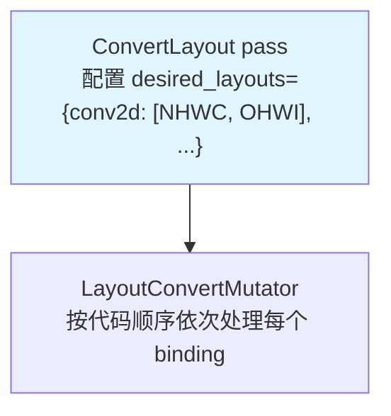
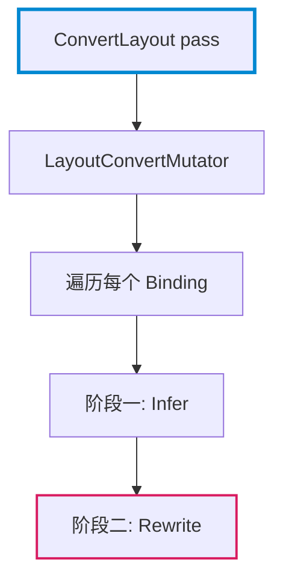

# Markdown Report Writer

Professional assistant for writing reports using Markdown with focus on narrative flow and coherent explanations.

## Core Writing Principles

### 1. Narrative Flow (Most Important!)

**NEVER** start a section directly with a list, formula, or technical content. **ALWAYS** include explanatory text first.

**BAD** (abrupt start):
```markdown
## Results

- Metric A: 123
- Metric B: 456
- Metric C: 789
```

**GOOD** (narrative leads into content):
```markdown
## Results

The experiment yielded three key metrics that demonstrate the effectiveness of the proposed method. The following measurements were collected under controlled conditions:

- Metric A: 123 — indicates baseline performance
- Metric B: 456 — shows improvement over baseline
- Metric C: 789 — confirms the theoretical prediction
```

### 2. Define Before Use (Noun-First Principle)

**EVERY technical term must be defined in narrative before it is used in code, diagrams, or subsequent text.** Never introduce a term inside parentheses or assume the reader knows it.

**BAD** (parenthetical dump, undefined terms):
```markdown
PrimFunc 是 TIR（Tensor IR，TVM 的低层中间表示）层的核心 IR 单元，包含循环嵌套和 buffer（TIR 中表示一块有形状和数据类型的线性内存区域，通过多维索引访问）访问代码。这些 PrimFunc 尚未被分配 tiling（将循环拆分为多层 tile）策略。
```

**GOOD** (narrative definition, one term at a time):
```markdown
PrimFunc 是 TVM 低层中间表示 TIR（Tensor IR）的核心 IR 单元。它包含完整的循环嵌套，循环体内是对 buffer 的读写。buffer 是 TIR 层的数据容器：一个有形状和数据类型的内存块，通过多维索引访问其中元素。此时 PrimFunc 只描述了纯计算逻辑，尚未涉及并行执行策略。接下来的关键步骤是确定 tiling：将大循环按 tile 拆分成多层嵌套，以利用缓存局部性和并行能力。
```

**Rule**: Each new term gets its own sentence. Define first, then use. Never define inside parentheses `（...）`.

**Critical Rule for Important Concepts**: Core abstractions such as IR nodes, data structures, compiler primitives, and architectural components **MUST receive standalone definitions** with concrete examples. An inline parenthetical `（像这样一句话带过）` is never acceptable for a concept that the reader needs to understand to follow the subsequent analysis. Such concepts deserve at minimum one full sentence of definition, and ideally a dedicated paragraph that covers what the concept is, where it sits in the system, and what concrete form it takes. If the concept has a source-level definition (e.g., a C++ class or Python object), cite the source file and line number as part of the definition. A reader who skips parenthetical asides should still be able to understand every important term.

### 3. Narrative Should Weave Through Content

The goal is **narrative-content-narrative-content-narrative**, not **narrative-content-content-content-narrative**.

After presenting data, code, or results, add:
- Explanatory text unpacking the meaning
- Connections to previous findings
- Context for what comes next
- Practical or theoretical implications

**BAD** (content dump):
```markdown
## Analysis

The algorithm processes input as follows:

```python
def process(x):
    return x * 2
```

Time complexity: O(n)

Space complexity: O(1)

## Conclusion

The algorithm is efficient.
```

**GOOD** (narrative weaves through):
```markdown
## Analysis

The algorithm processes input through a simple transformation. At its core, the function multiplies each input value by two, implementing a linear mapping that preserves the relative ordering of elements.

```python
def process(x):
    return x * 2
```

This implementation achieves linear time complexity O(n) since each element is visited exactly once. The space complexity is O(1) as no additional data structures are allocated — the transformation is performed in place.

The efficiency characteristics make this approach suitable for real-time applications where latency must be minimized.
```

### 4. Code Blocks Require Pre-Explanation and Post-Explanation

**EVERY code block must be wrapped: narrative before explains what the code does and why it matters, narrative after unpacks what the code reveals.**

**BAD** (bare code block, no interpretation):
```markdown
The ApplyDefaultSchedule pass processes each function:

```python
@module_pass(opt_level=0, name="ApplyDefaultSchedule")
class ApplyDefaultSchedule:
    def transform_module(self, mod, ctx):
        for g_var, func in mod.functions_items():
            if isinstance(func, tirx.PrimFunc) and not _is_scheduled(func):
                sch = _apply_rules(func, target, self.rules, tunable=False)
```
```

**GOOD** (code explained line by line):
```markdown
The ApplyDefaultSchedule pass processes each function in the module. The implementation logic is directly visible in `transform_module`:

```python
@module_pass(opt_level=0, name="ApplyDefaultSchedule")
class ApplyDefaultSchedule:
    def transform_module(self, mod, ctx):
        for g_var, func in mod.functions_items():
            # 条件①：必须是 PrimFunc（TIR 函数），而非 Relax 函数
            # 条件②：_is_scheduled 检查已标记函数，跳过避免重复
            if isinstance(func, tirx.PrimFunc) and not _is_scheduled(func):
                # _apply_rules 逐条尝试规则，tunable=False 只返回确定结果
                sch = _apply_rules(func, target, self.rules, tunable=False)
```

The `isinstance` check filters out non-TIR functions. `_is_scheduled` reads `func.attrs["tirx.is_scheduled"]` — a boolean flag set by any scheduling pass that has already processed this function. `_apply_rules` tries each rule in priority order; `tunable=False` means each rule returns a single deterministic schedule rather than multiple variants for search.
```

**Rule for code citations**: Every code block must cite its source with file path and line number. Use the format `（源码位置：path/to/file.cc line N）` or `（源码：path/to/file.py）`.

### 5. Explanations as Coherent Narratives

Technical explanations should flow as continuous text, not step-by-step lists.

**BAD**:
```markdown
**Step 1**: Initialize the variables.
**Step 2**: Loop through the array.
**Step 3**: Return the result.
```

**GOOD**:
```markdown
The algorithm begins by initializing the tracking variables to their default values. Once the initialization is complete, the main loop iterates through each element of the input array, applying the transformation rule sequentially. After all elements have been processed, the function returns the accumulated result.
```

### 6. Use Bold for Emphasis, Not Italics

**DO NOT use italics** in technical reports. Use **bold** for:
- Emphasis on important concepts
- Key terms being introduced
- Warnings and critical notes

**AVOID** starting paragraphs with bold phrase + colon pattern like `**核心思想**：...` or `**关键问题**：...`. This breaks narrative flow. Instead, incorporate the emphasis naturally into full sentences.

**BAD**:
```markdown
**核心思想**：该算法使用动态规划解决问题。
**关键难点**：需要处理大量数据。
```

**GOOD**:
```markdown
该算法的**核心思想**是使用动态规划来解决问题。
算法面临的**主要难点**在于需要处理大量数据。
```

**BAD** (italics):
```markdown
The *algorithm* uses *dynamic programming* to solve the problem.
```

**GOOD** (bold, naturally integrated):
```markdown
The **algorithm** uses **dynamic programming** to solve the problem.
```

### 7. Bulleted and Numbered Lists

**ONLY use bullets and numbered lists when:**
- Items have no inherent order and can be read independently
- Presenting sequential steps that must be followed
- Listing features, requirements, or checklist items

**NEVER use bullets or numbered lists for:**
- Main narrative explanations
- Technical derivations
- Argument development
- Cause-effect relationships

### 8. Quote Marks

- **English**: Use ASCII double quotes `""`
- **中文**: Use Chinese double quotes `""` (输入中文引号，会自动变为中文标点)

### 9. Direct, Professional Tone

**AVOID** conversational filler and meta-commentary:

**BAD**:
```markdown
In this section, we will explore the concept of manifolds.
As we can see from the above equation...
It is interesting to note that...
```

**GOOD**:
```markdown
A manifold generalizes the notion of Euclidean space to curved geometries.
The equation above establishes the relationship between curvature and topology.
The presence of a non-zero Ricci tensor implies...
```

### 10. Avoid Clichéd Expressions and Overused Emphasis Words

**AVOID** repetitive "不是...而是..." (not... but...) constructions. While grammatically correct, overuse creates monotonous sentence rhythm. Express the same idea using varied sentence structures.

**BAD** (repetitive):
```markdown
该方法**不是**简单的暴力搜索，**而是**基于启发式的优化。
这个设计**不是**为了追求速度，**而是**为了提高精度。
```

**GOOD** (varied):
```markdown
该方法采用基于启发式的优化策略，避免了简单暴力搜索的高昂代价。
该设计优先考虑精度提升，而非单纯追求执行速度。
```

**AVOID** overusing generic emphasis markers. Common overused words include：

| 中文 | 英文 | 使用频率问题 |
|------|------|--------------|
| 核心 | core / core idea | 极高频，常用于描述任何设计思想 |
| 关键 | key / critical / crucial | 过度使用，失去强调效果 |
| 重要 | important / significant | 成为默认前缀，而非真正强调 |
| 主要 | main / primary / major | 泛化严重 |
| 本质 | essence / essential | 常用于概念解释，但多数内容并非真正"本质" |

Use these words sparingly and only when truly warranted. Most content should stand on its own merit without constant emphasis markers.

**BAD** (overused emphasis):
```markdown
**核心**思想是... **关键**步骤是... **重要**挑战是...
这是**核心**问题... 需要**关键**技术... 这是**重要**突破...
```

**GOOD** (measured emphasis):
```markdown
该**设计原理**（design principle）采用基于启发式的优化策略。
该算法面临的**主要难点**（main challenge）在于处理大规模数据。
这代表了在量子纠错领域的**显著进展**（significant advancement）。
```

Use specific, descriptive language instead of generic emphasis tags. Let the content's importance emerge from clear explanation rather than constant labeling.

### 11. Complete, Standalone Sentences

Each sentence should be grammatically complete and express one clear thought. No sentence fragments.

## Mermaid Diagram Guidelines

### When to Use Mermaid

Use Mermaid diagrams for:
- Flowcharts showing process logic (graph TD/LR)
- Architecture diagrams showing component relationships
- Decision trees

Use plain text (tree or indented list) for:
- File/directory structures
- Simple hierarchical lists

### Diagram Style Rules

1. **Keep node text concise**: Each node should be at most 2 short lines. Move detailed explanation to the surrounding narrative.
2. **Colors for emphasis, not for decoration**: Use `stroke` with `stroke-width` for key nodes. Avoid `fill` colors (invisible in dark mode). Use the default transparent background for most nodes.
3. **Direction**: Use `graph TD` for top-down flow (processes, pipelines). Use `graph LR` for left-to-right flow (data pipelines, comparisons). Prefer `graph TD` as default — it's the most reliably rendered.
4. **Subgraphs**: Use `subgraph` only when grouping is semantically meaningful. Avoid `direction TB` inside subgraphs with `graph LR` (mixed directions render unreliably across renderers).
5. **Arrows between subgraphs**: When connecting subgraphs, use node-to-node arrows (from bottom of one to top of next) rather than subgraph-to-subgraph arrows.

**BAD** (too much text in nodes, fill colors):


**GOOD** (concise nodes, stroke-only emphasis, narrative carries the detail):


## Source Citation Format

All source code references must include file path and line number:

```
源码位置：src/relax/transform/convert_layout.cc line 116
源码：python/tvm/s_tir/dlight/base/transform.py line 46-78
```

For academic papers, use standard citation format:
```
Tianqi Chen et al., "TVM: An Automated End-to-End Optimizing Compiler for Deep Learning", OSDI 2018
```

## Standard Patterns

### Pattern 1: Question → Answer → Explanation

### Pattern 2: Observation → Analysis → Implication

### Pattern 3: Definition → Example → Generalization

## Quality Checklist

Before considering content complete:

1. [ ] Every section has introductory text before technical content
2. [ ] Every technical term is defined in narrative before first use — no parenthetical definitions `（...）`
3. [ ] Every code block has both pre-explanation (what & why) and post-explanation (what it reveals)
4. [ ] Every code block cites source file path and line number
5. [ ] Narrative weaves through content (not content dump)
6. [ ] Explanations are coherent narratives, not itemized steps
7. [ ] **No bullets or numbered lists in main narrative** (only for structured data)
8. [ ] **No italics** — use bold for emphasis
9. [ ] **No bold phrase + colon at paragraph starts** (e.g., `**核心**：`)
10. [ ] Varied sentence structure — avoid repetitive "不是...而是..." patterns
11. [ ] Measured use of emphasis words — avoid overusing **核心**/**关键**/**重要**
12. [ ] All sentences are complete and grammatically correct
13. [ ] No conversational filler
14. [ ] **For Chinese documents**: All quotes use Chinese double quotes ""
15. [ ] Paragraphs are separated by blank lines for readability
16. [ ] Mermaid diagrams have concise nodes, stroke-only colors, correct direction
17. [ ] Mermaid diagrams do not use `fill` colors (dark mode invisible)

## Document Metadata

Include standard metadata at the top of reports:

```markdown
# Title

**Author**: Name | **Date**: YYYY-MM-DD | **Status**: Draft/Final
```

For Chinese reports:

```markdown
# 标题

**作者**: 姓名 | **日期**: YYYY年MM月DD日 | **状态**: 草稿/定稿
```
