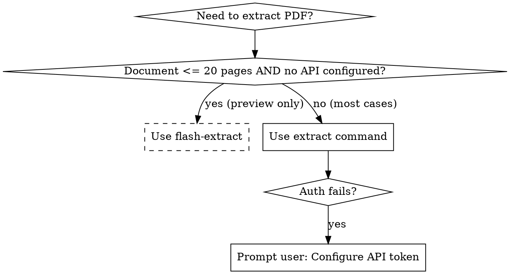

# MinerU PDF Extraction

## Overview
Use the **extract** command (not flash-extract) for PDF to Markdown conversion. The user has already configured API credentials, so precision extraction is available. Flash-extract is a 20-page preview tool, not for production use.

**⚠️ Default Behavior for this Skill**: Always use `-o` parameter to output to a file. While `mineru-open-api extract` defaults to stdout, **this skill requires file output** to preserve assets and avoid terminal clutter.

## Quick Reference

| Scenario | Command | Notes |
|----------|---------|-------|
| **Extract to file (Recommended)** | `mineru-open-api extract file.pdf -o ./out/` | **Default for this skill** - saves with assets |
| Extract to stdout | `mineru-open-api extract file.pdf` | Outputs to terminal - NOT recommended |
| Batch processing | `mineru-open-api extract *.pdf -o ./results/` | Multiple files at once |
| Specific format | `mineru-open-api extract file.pdf -f md,html` | Multiple output formats |
| Page range | `mineru-open-api extract file.pdf --pages 1-50` | Extract specific pages |

## When to Use



## Command Comparison

| Feature | extract | flash-extract |
|---------|---------|---------------|
| **Auth Required** | Yes | No |
| **Max Pages** | 600 | **20** |
| **Max File Size** | 200MB | 10MB |
| **Formats** | md, json, html, latex, docx | md only |
| **Assets** | Full images, tables, formulas | Placeholders only |
| **Use Case** | Production extraction | Quick preview only |

## Implementation

### Standard Usage
```bash
# Extract to directory with all assets (RECOMMENDED)
mineru-open-api extract document.pdf -o ./output/

# Extract multiple formats
mineru-open-api extract document.pdf -o ./out/ -f md,html,latex

# Extract to stdout (markdown) - NOT recommended, use only for debugging
mineru-open-api extract document.pdf
```

### Batch Processing
```bash
# Multiple PDFs
mineru-open-api extract *.pdf -o ./results/

# From file list
mineru-open-api extract --list files.txt -o ./results/
```

### When Auth Fails

If `mineru-open-api extract` fails with authentication error:

**Inform the user:**
```
The extract command requires API authentication. Please configure your MinerU API token:

mineru-open-api auth

After configuring the token, extraction will work for documents up to 600 pages and 200MB.
```

**Do NOT fallback to flash-extract without warning.** Flash-extract has a 20-page limit and will truncate larger documents.

## Common Mistakes

| Mistake | Problem | Fix |
|---------|---------|-----|
| Not using `-o` parameter | Outputs to terminal, loses assets, clutters console | **Always use `-o` to save to file** |
| Using flash-extract for large PDFs | **20-page hard limit**, truncates content | Always use `extract` for production |
| Flashing because "faster" | Preview quality, missing assets | User configured API — use it |
| Silent fallback to flash | Data loss without warning | Prompt user to configure auth |
| Extracting without checking page count | Unknown if content is complete | Verify document size first |

## Real-World Impact

- **Flash-extract truncation:** 100-page PDF → Only first 20 pages extracted, 80 pages lost
- **Asset quality:** Flash uses placeholders like `[Image: 1]` instead of actual images
- **Batch failures:** Large documents fail silently with flash-extract
